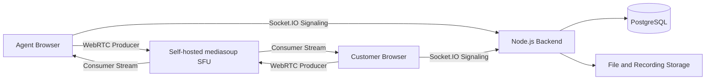
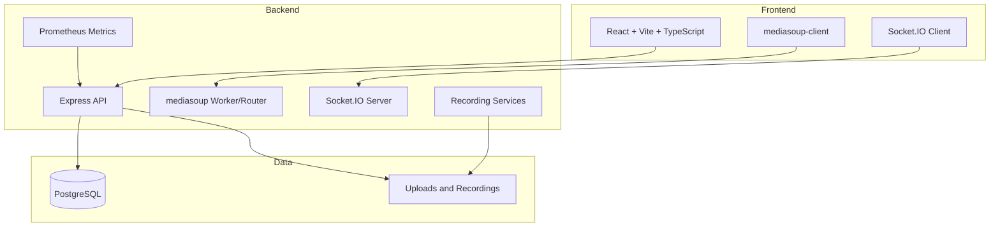
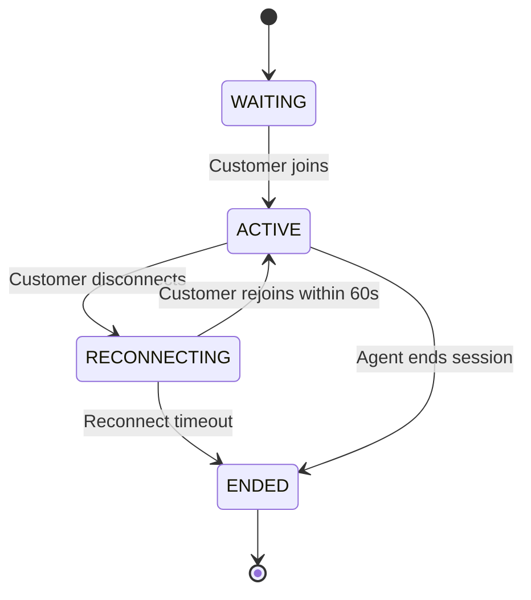

# AtomAssist Live

> A self-hosted real-time video support platform with secure support sessions, mediasoup SFU video routing, realtime chat, file sharing, session review, recording artifacts, admin monitoring, and observability.

AtomAssist Live was built for a 15-hour hackathon as a production-minded WebRTC customer support platform. It is not just a video call demo. It implements the complete support-session layer around WebRTC: agents, customers, secure invites, SFU media routing, reconnect handling, chat, files, recordings, case review, admin controls, and metrics.

---

## Why AtomAssist Stands Out

Most hackathon video apps stop at “two browsers can see each other.”

AtomAssist goes further:

* It uses a **self-hosted mediasoup SFU**, not a hosted video SDK.
* It implements a real **agent-to-customer support workflow**.
* It separates **disconnect** from **session end** with a reconnect window.
* It persists the support session as a reviewable case record.
* It includes chat, files, recordings, admin dashboards, and observability.
* It documents the production path for true server-side SFU recording.

---

## Demo Screenshots

### Agent Dashboard


Agents can create support sessions, manage active sessions, and open persisted history.

### Admin Dashboard


Admins can monitor all sessions, status counts, participants, events, chat counts, and force-end sessions.

### Live Video Support Room


The live room includes self-hosted SFU video, realtime chat, file sharing, recording controls, participant status, and session lifecycle actions.

### Customer Experience


Customers join directly through a secure browser invite link without installing any app.

### Session History and Support Case Review


Every session becomes a reviewable support case with duration, participants, events, chat, files, recordings, and resolution notes.

### Observability Dashboard


AtomAssist exposes human-friendly operational metrics and a raw Prometheus-compatible `/metrics` endpoint.

### Recording Architecture


The app includes a stable browser tab recording MVP and an experimental server-side SFU recording spike using mediasoup PlainTransport and FFmpeg.

---

## Core Features

| Area                                   | Implemented |
| -------------------------------------- | ----------- |
| Agent login                            | Yes         |
| Admin login                            | Yes         |
| Role-aware protected routes            | Yes         |
| Secure invite links                    | Yes         |
| Customer browser join flow             | Yes         |
| Self-hosted SFU video/audio            | Yes         |
| Socket.IO signaling                    | Yes         |
| Realtime chat                          | Yes         |
| File sharing                           | Yes         |
| Session event timeline                 | Yes         |
| Customer reconnect window              | Yes         |
| Agent-controlled session ending        | Yes         |
| Invite expiry after session end        | Yes         |
| Session history                        | Yes         |
| Support case review notes              | Yes         |
| Call duration tracking                 | Yes         |
| Browser tab recording MVP              | Yes         |
| Experimental server-side SFU recording | Yes         |
| Admin dashboard                        | Yes         |
| Observability dashboard                | Yes         |
| Prometheus metrics endpoint            | Yes         |

---

## Hackathon Requirement Compliance

### Must-Haves

* Browser-based customer support session
* Agent can create and manage support sessions
* Customer can join through an invite link
* Working realtime audio/video
* No hosted video APIs
* Self-hosted media infrastructure
* Working demo or screen recording
* Code repository
* Architecture and limitations documented

### Strong Good-to-Haves

* Realtime chat
* Persistent chat history
* File sharing
* Admin dashboard
* Session review
* Call duration
* Reconnect handling
* Recording artifacts
* Production observability
* Prometheus metrics
* Server-side recording spike

---

## Media Architecture

AtomAssist uses **mediasoup** as a self-hosted Selective Forwarding Unit.

The browsers do not depend on Twilio, Agora, Daily, Vonage, LiveKit Cloud, or any hosted video API.



---

## System Architecture



---

## Session Lifecycle

AtomAssist treats dropped calls and ended sessions differently.



This matters in real support workflows. A short network drop should not immediately destroy the support session. The customer can rejoin within the reconnect window. The invite expires only when the session ends.

---

## Recording Strategy

AtomAssist includes two recording paths.

### 1. Stable Browser Tab Recording MVP

The agent selects the AtomAssist browser tab/window. The browser records the tab using the MediaRecorder API and uploads the final `.webm` artifact to the backend.

Lifecycle:

```text
IN_PROGRESS -> PROCESSING -> READY
```

This recording is reliable for demos and support-case review.

### 2. Experimental Server-Side SFU Recording Spike

AtomAssist also includes an experimental server-side recording path:

```text
mediasoup Producer
-> server-side Consumer
-> PlainTransport RTP forwarding
-> FFmpeg
-> WebM artifact
-> Session history
```

This proves the production direction for SFU-side recording. In a production version, this would be expanded into a hardened recorder service with audio/video composition, retry handling, object storage, recording workers, and FFmpeg/GStreamer pipelines.

---

## Tech Stack

### Frontend

* React
* Vite
* TypeScript
* Tailwind CSS
* Socket.IO Client
* mediasoup-client

### Backend

* Node.js
* Express
* TypeScript
* Socket.IO
* mediasoup
* Prisma
* PostgreSQL
* JWT authentication
* multer uploads
* FFmpeg recording spike
* prom-client metrics

### Infrastructure

* pnpm workspaces
* Docker Compose for PostgreSQL
* Local filesystem storage for hackathon uploads/recordings
* Production-ready environment configuration

---

## Local Setup

### 1. Install dependencies

```bash
pnpm install
```

### 2. Start PostgreSQL

```bash
docker compose up -d
```

### 3. Run Prisma migration

```bash
pnpm --filter @atomassist/server prisma:migrate
pnpm --filter @atomassist/server prisma:generate
```

### 4. Start development servers

```bash
pnpm dev
```

Frontend:

```text
http://localhost:5173
```

Backend:

```text
http://localhost:4000
```

Health check:

```bash
curl http://localhost:4000/health
```

Metrics:

```text
http://localhost:4000/metrics
```

---

## Demo Credentials

Agent:

```text
agent@demo.com
demo123
```

Admin:

```text
admin@demo.com
demo123
```

---

## Demo Flow

1. Login as agent.
2. Create a new support session.
3. Copy the customer invite link.
4. Open the invite in another browser or incognito window.
5. Customer joins the support room.
6. Show local and remote video routed through the self-hosted SFU.
7. Send realtime chat messages.
8. Upload and download a file inside the session.
9. Close the customer tab and show reconnect handling.
10. Rejoin within the reconnect window.
11. Start and stop browser tab recording.
12. Optionally start and stop experimental server-side SFU recording.
13. End the session.
14. Open session history.
15. Save review notes and resolution status.
16. Open admin dashboard.
17. Open observability dashboard.
18. Open recording architecture page.

---

## Key Product Screens

| Route                         | Purpose                           |
| ----------------------------- | --------------------------------- |
| `/agent/login`                | Agent/admin login                 |
| `/agent/dashboard`            | Agent session management          |
| `/join/:inviteToken`          | Customer invite page              |
| `/call/:sessionId`            | Live support room                 |
| `/session/:sessionId/history` | Support case review               |
| `/admin`                      | Admin dashboard                   |
| `/admin/observability`        | Metrics dashboard                 |
| `/admin/recording`            | Recording architecture page       |
| `/metrics`                    | Raw Prometheus-compatible metrics |

---

## Security and Access Control

* JWT-based authentication
* Role-aware protected routes
* Agent/admin/customer separation
* Invite token validation
* Ended sessions reject new joins
* Customer access scoped to one session
* File downloads require session access
* Recording downloads require session access
* Admin can monitor all sessions

---

## Observability

AtomAssist exposes a Prometheus-compatible metrics endpoint and a human-readable dashboard.

Tracked metrics include:

* HTTP request count
* HTTP request duration
* Active Socket.IO connections
* Sessions by status
* Participants by status
* Persisted chat messages
* Uploaded files
* Recordings
* Node.js runtime metrics

Raw metrics endpoint:

```text
/metrics
```

Admin dashboard:

```text
/admin/observability
```

---

## Project Structure

```text
AtomAssist/
  apps/
    server/
      prisma/
      src/
        media/
        middleware/
        metrics/
        realtime/
        recording/
        routes/
        services/
        system/
    web/
      src/
        components/
        pages/
        routes/
        lib/
  packages/
    shared/
  docs/
    screenshots/
    DEMO_SCRIPT.md
    ARCHITECTURE.md
    PRODUCTION_NOTES.md
```

---

## Production Upgrade Path

AtomAssist is built as a hackathon MVP with a production-aware architecture.

Recommended production upgrades:

* Replace demo users with database-backed users.
* Add password hashing with Argon2 or bcrypt.
* Add refresh tokens or secure cookie sessions.
* Move uploads and recordings to S3-compatible object storage.
* Add coturn for reliable NAT traversal.
* Deploy mediasoup on a VM with opened RTC UDP/TCP ports.
* Add Redis adapter for Socket.IO horizontal scaling.
* Add proper SFU-side mixed recording with FFmpeg/GStreamer.
* Add recording workers and background queues.
* Add audit logs and organization/team roles.
* Add Grafana dashboards and alerting.

---

## Known Limitations

* Demo users are hardcoded for hackathon speed.
* Local filesystem is used for uploads and recordings.
* Browser tab recording is the stable recording MVP.
* Server-side SFU recording is experimental and currently records selected SFU producer streams.
* Public deployment needs a VM-style host with RTC media ports, not a serverless frontend-only platform.
* TURN server is required for robust production internet connectivity.

---

## Why This Should Win

AtomAssist is not a wrapper around a hosted video SDK. It demonstrates real WebRTC infrastructure work with a self-hosted SFU and the product layer needed for actual customer support:

* secure sessions,
* browser-based customer access,
* SFU media routing,
* realtime signaling,
* reconnect handling,
* chat,
* file artifacts,
* recording artifacts,
* support case review,
* admin monitoring,
* and observability.

It is both a working hackathon demo and a credible foundation for a production-grade video support platform.
